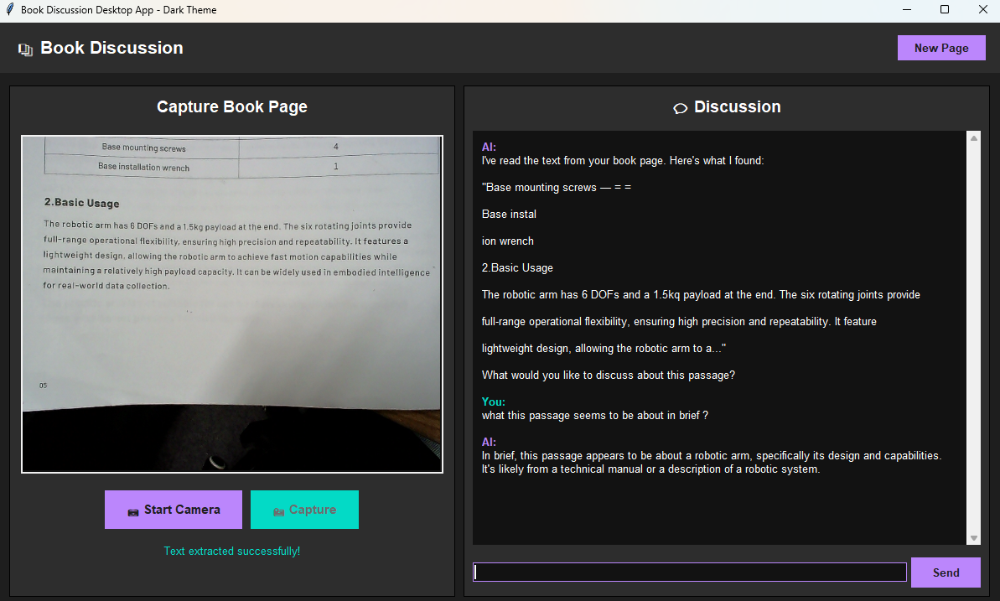

<h1 align="center"> 📚 Book Discussion Desktop App </h1>

A sophisticated desktop application that combines computer vision and AI to help you read, analyze, and discuss books. Capture book pages with your camera, extract text using OCR, and engage in intelligent conversations about the content with AI.



## ✨ Features

### 🎯 Core Functionality
- **📷 Camera Integration**: Real-time camera feed for capturing book pages
- **🔤 OCR Text Extraction**: Automatic text recognition using Tesseract OCR
- **🤖 AI-Powered Discussions**: Intelligent book discussions using Groq's LLM API
- **🖼️ Scene Description**: AI-powered image captioning for visual content analysis
- **🎨 Dark Theme**: Modern, eye-friendly dark theme interface

### 💡 Advanced Capabilities
- **Multi-threaded Processing**: Non-blocking UI during heavy operations
- **Real-time Camera Feed**: Live preview with capture functionality
- **Conversation History**: Maintains context throughout discussions
- **Error Handling**: Robust error handling with user-friendly messages
- **Cross-platform**: Built with Python and Tkinter for wide compatibility

## 🚀 Quick Start

### Prerequisites

- Python 3.8 or higher
- Tesseract OCR installed
- Webcam
- Groq API key (free)

### Installation

1. **Clone the repository**
   ```bash
   git clone https://github.com/YussifAmmar/ReadingBuddy
   cd ReadingBuddy
   pip install -r requirements.txt

2 **Donload Tesseract OCR**
- for win : https://thelinuxcode.com/install-tesseract-windows/
- or from the official repo : https://github.com/tesseract-ocr/tesseract

3 **Get your groq api**
- from : https://groq.com/ -> click **Developers** -> **free api keys**
<br>

<h3 align="center"> 4  Enjoy your reading buddy :)) </h3>
